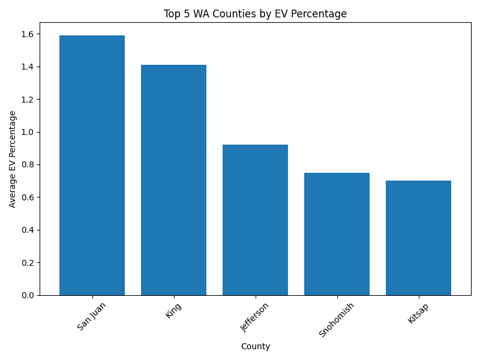
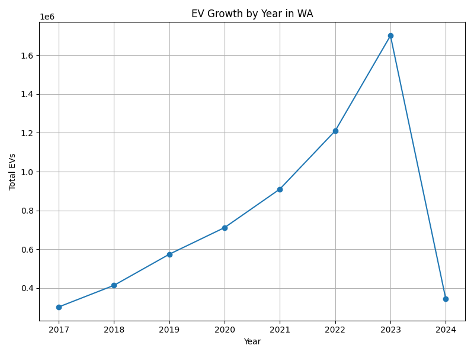
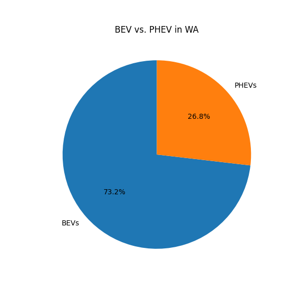

# WA-EV-Adoption Analysis in SQL
Analyzed electric vehicle (EV) registration data from Washington State using PostgreSQL to explore adoption trends across counties.

## Overview
Analyzed electric vehicle (EV) registration data from Washington State using PostgreSQL to explore adoption trends across counties.

## Dataset
- **Source**: [[data.wa.gov](https://data.wa.gov/Transportation/Electric-Vehicle-Population-Size-History-By-County-/3f4k-prv3)](https://www.kaggle.com/datasets/sahirmaharajj/electric-vehicle-population-size-2024/data)
- **Columns**: Date, County, State, Vehicle Primary Use, BEVs, PHEVs, EV Total, Non-EV Total, Total Vehicles, Percent EVs
- **Cleaning**: Handled commas (e.g., `3,575`) and dates (`September 30 2022`) using Python (`clean_csv.py`).

## Key Findings
- **Top Counties by EVs**: [e.g., King County: 3,309,850]
- **Top Counties by Percentage**: [e.g., San Juan Island: 1.59%]
- **Relative Growth**: EVs grew from 0.3% of the fleet in 2017 to 1.7% of the fleet by 2023 increasing by 1.4% of the total cars on the road in that time. 
- **BEV vs. PHEV**: BEVs are 73.2% of WA Evs and PHEVs are 26.8%

## Visualizations

## Files
- `wa_ev_analysis.sql`: SQL queries 
- `visualizations`: Charts

## Setup
1. Install PostgreSQL/pgAdmin and Python (`pandas`, `matplotlib`).
2. Run `clean_csv.py` to preprocess CSV.
3. Create `ev_registration` table and import CSV.
4. Run queries in `wa_ev_analysis.sql`.
5. Run `EV visuals.py` for charts.

## Tools
- PostgreSQL/pgAdmin
- Python (`pandas`, `matplotlib`)
- Microsoft Excel 365
